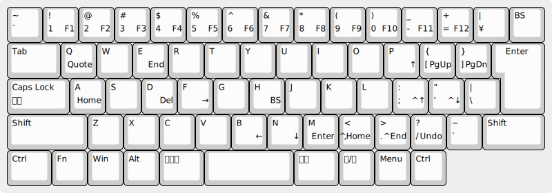

# wmacs-jus.ahk

Windows/Emacs compromise key bindings for US like layout on JIS keyboard.

## 概要

- Emacs/US キーボードユーザーのための Windows/JIS キーボード用のキーバインドです
- JIS キーボード上に US 配列を実現します
- Windows の基本的なショートカットと Emacs 風のカーソル移動などが利用できます
- [AutoHotkey 2](https://www.autohotkey.com/) で実装されています

## JUS 配列

- 記号などの配置が US キーボード風になります
- `半角/全角` は `Esc` に、 `ひらがな` は `半角/全角` になります

## Wmacs キーバインド

### Windows ショートカット

- `C-z`/`x`/`c`/`v`: アンドゥ/カット/コピー/ペーストなど

### Emacs 風のカーソル移動・編集

- `C-p`/`n`/`b`/`f`: カーソル上/下/左/右
- `C-d`/`h`/`m`: 削除/バックスペース/改行
- `C-q`: 次のキーをそのまま入力 (`C-q` `C-f` で検索、`C-q` `C-n` で新規 など)

### Wmacs 独自のショートカット

- `C-[`/`]`: ページスクロール
- `C-;`/`'`: 行スクロール
- `C-,`/`.`: 先頭/末尾までスクロール
- `C-3`: `F3` など

## ヒント

- [Ctrl2Cap](https://learn.microsoft.com/ja-jp/sysinternals/downloads/ctrl2cap) などで `英数` を `Ctrl` にリマップすると便利です
- `RCtrl` (Right Ctrl) は Wmacs に影響されません。`RCtrl+f` や `RCtrl+n` は (カーソル移動ではなく) Windows 本来の `Ctrl+f` (検索) や `Ctrl+n` (新規) になります
- 日付入力: `C-S-;` で `2025-04-12` 形式で、 `C-S-'` で `250412` 形式で日付入力ができます
- `RShift-Esc` で wmacs-jus.ahk を再読み込みします
